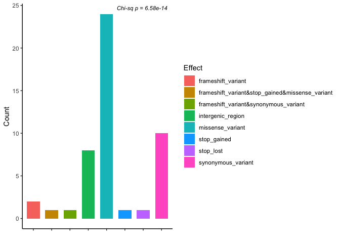
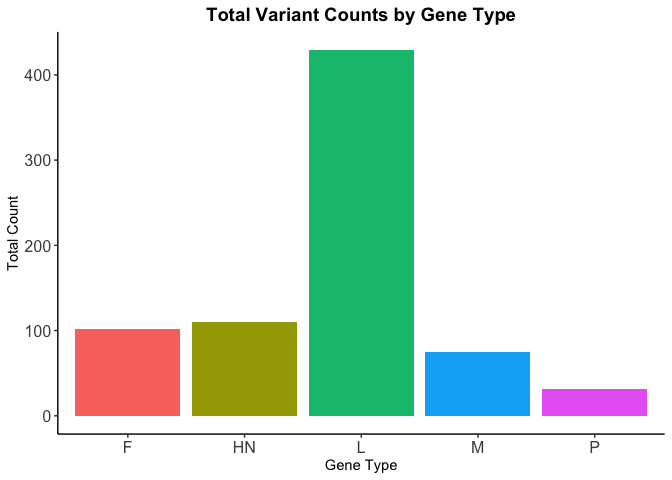
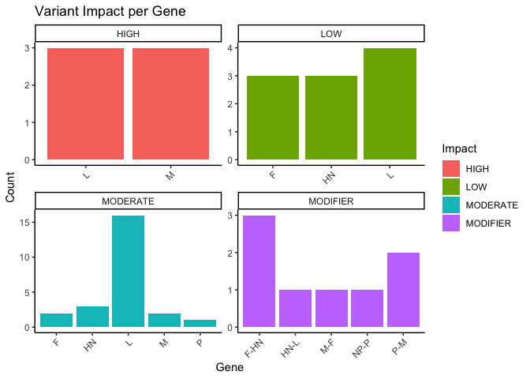

``` r
#Load Library
library(tidyverse)
```

    ## ── Attaching core tidyverse packages ──────────────────────── tidyverse 2.0.0 ──
    ## ✔ dplyr     1.1.4     ✔ readr     2.1.5
    ## ✔ forcats   1.0.0     ✔ stringr   1.5.1
    ## ✔ ggplot2   3.5.1     ✔ tibble    3.2.1
    ## ✔ lubridate 1.9.4     ✔ tidyr     1.3.1
    ## ✔ purrr     1.0.2     
    ## ── Conflicts ────────────────────────────────────────── tidyverse_conflicts() ──
    ## ✖ dplyr::filter() masks stats::filter()
    ## ✖ dplyr::lag()    masks stats::lag()
    ## ℹ Use the conflicted package (<http://conflicted.r-lib.org/>) to force all conflicts to become errors

``` r
library(ggplot2)
library(vcfR)
```

    ## 
    ##    *****       ***   vcfR   ***       *****
    ##    This is vcfR 1.15.0 
    ##      browseVignettes('vcfR') # Documentation
    ##      citation('vcfR') # Citation
    ##    *****       *****      *****       *****

``` r
#Load data
vcf_data2 <- read.vcfR("Sample_2.vcf", verbose = TRUE)
```

    ## Scanning file to determine attributes.
    ## File attributes:
    ##   meta lines: 31
    ##   header_line: 32
    ##   variant count: 48
    ##   column count: 10
    ## Meta line 31 read in.
    ## All meta lines processed.
    ## gt matrix initialized.
    ## Character matrix gt created.
    ##   Character matrix gt rows: 48
    ##   Character matrix gt cols: 10
    ##   skip: 0
    ##   nrows: 48
    ##   row_num: 0
    ## Processed variant: 48
    ## All variants processed

``` r
vcf_data2
```

    ## ***** Object of Class vcfR *****
    ## 1 samples
    ## 1 CHROMs
    ## 48 variants
    ## Object size: 0 Mb
    ## 0 percent missing data
    ## *****        *****         *****

``` r
# Get the "ANN" field (which contains variant annotations) from the VCF data
annotations <- extract.info(vcf_data2, "ANN")  # Extracting the ANN field from INFO
# For each variant, split the annotation string into separate pieces if there are multiple (they're separated by commas)
ann_list <- strsplit(annotations, ",")
# From each list of annotations, just take the first one (to keep things simple)
# Then split that annotation into its parts using the "|" symbol, which separates the details
# If there's no annotation, just create a list of NA (empty values) to fill the space
first_ann <- lapply(ann_list, function(x) {
  if (length(x) > 0) {
    fields <- strsplit(x[1], "\\|")[[1]]  # Extract the first annotation for simplicity
    fields
  } else {
    rep(NA, 17)  # Pad with NA for missing annotations
  }
})
```

``` r
# Find the maximum number of fields across all annotation entries
# (Some annotations might have fewer fields than others)
max_cols <- max(sapply(first_ann, length))

# Make sure every annotation has the same number of fields
# If any annotation has fewer fields, fill the rest with NA
first_ann <- lapply(first_ann, function(x) {
  length(x) <- max_cols  # Set the length to the max number of fields
  x  # Return the padded annotation
})
```

We don’t use data.frame(first_ann) because it would create a
single-column data frame with list elements, instead of a proper
multi-column structure where each annotation field is in its own column.

``` r
#Assign column names according to the snpEff annotation schema, truncating if necessary.
ann_df <- do.call(rbind, first_ann)
colnames(ann_df) <- c("Allele", "Effect", "Impact", "Gene", "Gene_ID", 
                      "Feature_Type", "Feature_ID", "Transcript_BioType", 
                      "Rank", "HGVS.c", "HGVS.p", "cDNA.pos", "CDS.pos", 
                      "AA.pos", "Distance", "ERRORS", "WARNINGS")[1:max_cols]
```

``` r
head(ann_df)
```

    ##      Allele Effect              Impact     Gene   Gene_ID Feature_Type       
    ## [1,] "GG"   "intergenic_region" "MODIFIER" "NP-P" "NP-P"  "intergenic_region"
    ## [2,] "A"    "missense_variant"  "MODERATE" "P"    "P"     "transcript"       
    ## [3,] "T"    "intergenic_region" "MODIFIER" "P-M"  "P-M"   "intergenic_region"
    ## [4,] "AT"   "intergenic_region" "MODIFIER" "P-M"  "P-M"   "intergenic_region"
    ## [5,] "A"    "missense_variant"  "MODERATE" "M"    "M"     "transcript"       
    ## [6,] "C"    "missense_variant"  "MODERATE" "M"    "M"     "transcript"       
    ##      Feature_ID Transcript_BioType Rank  HGVS.c                  HGVS.p       
    ## [1,] "NP-P"     ""                 ""    "n.1593_1594delAAinsGG" ""           
    ## [2,] "P.t01"    "protein_coding"   "1/1" "c.14G>A"               "p.Arg5Gln"  
    ## [3,] "P-M"      ""                 ""    "n.3091C>T"             ""           
    ## [4,] "P-M"      ""                 ""    "n.3208_3209delGAinsAT" ""           
    ## [5,] "M.t01"    "protein_coding"   "1/1" "c.85G>A"               "p.Ala29Thr" 
    ## [6,] "M.t01"    "protein_coding"   "1/1" "c.512T>C"              "p.Ile171Thr"
    ##      cDNA.pos   CDS.pos    AA.pos    Distance
    ## [1,] ""         ""         ""        ""      
    ## [2,] "15/1188"  "14/1187"  "5/394"   ""      
    ## [3,] ""         ""         ""        ""      
    ## [4,] ""         ""         ""        ""      
    ## [5,] "86/1095"  "85/1094"  "29/363"  ""      
    ## [6,] "513/1095" "512/1094" "171/363" ""      
    ##      ERRORS                                   
    ## [1,] NA                                       
    ## [2,] "WARNING_TRANSCRIPT_MULTIPLE_STOP_CODONS"
    ## [3,] NA                                       
    ## [4,] NA                                       
    ## [5,] "WARNING_TRANSCRIPT_MULTIPLE_STOP_CODONS"
    ## [6,] "WARNING_TRANSCRIPT_MULTIPLE_STOP_CODONS"

``` r
# Convert ann_df to a data frame
ann_df <- as.data.frame(ann_df, stringsAsFactors = FALSE)
# Count how many times each unique 'Effect' appears in the annotation dataframe
effect_counts_df <- ann_df %>%
  count(Effect, name = "Count")
# Join the counts back to the original annotation dataframe
# This adds a new 'Count' column to ann_df, matching by the 'Effect' value
ann_df <- ann_df %>%
  left_join(effect_counts_df, by = "Effect")
```

``` r
# Perform Chi-square test to see if variant effects are equally distributed
chi_result <- chisq.test(effect_counts_df$Count)

# Extract the p-value from the test result
p_val <- chi_result$p.value

# Create the bar plot using ggplot
figure1 <- ggplot(effect_counts_df, aes(x = Effect, y = Count, fill = Effect)) +
  geom_bar(stat = "identity", width = 0.7) +                        # Create bars using actual count values
  theme_minimal() +                                    # Apply a clean minimal theme
  xlab("") +                                # Label for x-axis
  ylab("Count") +                                      # Label for y-axis
  theme_classic() +
  theme(axis.text.x = element_blank()) +  # Tilt x-axis labels for readability
  annotate("text",                                     # Add annotation text
           x = Inf, y = Inf,                           # Position at top-right of plot
           label = paste0("Chi-sq p = ", signif(p_val, 3)),  # Text with formatted p-value
           hjust = 1.1, vjust = 1.5,                   # Adjust text position
           size = 3, fontface = "italic")              # Text styling (size and italics)
# Display the plot
figure1
```

<!-- -->

``` r
library(dplyr)

# Getting data of gene by group
gene_summary <- ann_df %>%
  group_by(Gene) %>%
  summarise(Count = sum(Count))
gene_summary
```

    ## # A tibble: 10 × 2
    ##    Gene  Count
    ##    <chr> <int>
    ##  1 F        78
    ##  2 F-HN     24
    ##  3 HN      102
    ##  4 HN-L      8
    ##  5 L       429
    ##  6 M        51
    ##  7 M-F       8
    ##  8 NP-P      8
    ##  9 P        24
    ## 10 P-M      16

``` r
library(stringr)
```

``` r
# Clean up and summarize the gene types
gene_summary_clean <- gene_summary %>%
  mutate(Gene_clean = case_when(                 # Create a new simplified gene label column
    str_detect(Gene, "M") ~ "M",                 # Label "M" if "M" appears in the original string
    str_detect(Gene, "F") ~ "F",                 # Label "F" if "F" appears
    str_detect(Gene, "HN") ~ "HN",                 # Label "F" if "F" appears
    str_detect(Gene, "P") ~ "P",                 # Label "P" if "P" appears
    str_detect(Gene, "NP") ~ "NP",               # Label "NP" if "NP" appears
    TRUE ~ Gene                                  # Otherwise, keep the original label
  )) %>%
  group_by(Gene_clean) %>%                       # Group by the new gene label
  summarise(Total = sum(Count))                  # Sum all counts per gene group
gene_summary_clean
```

    ## # A tibble: 5 × 2
    ##   Gene_clean Total
    ##   <chr>      <int>
    ## 1 F            102
    ## 2 HN           110
    ## 3 L            429
    ## 4 M             75
    ## 5 P             32

``` r
# Plot the summarized gene counts
ggplot(gene_summary_clean, aes(x = Gene_clean, y = Total, fill = Gene_clean)) +
  geom_bar(stat = "identity") +  # Use actual values in 'Total' column
  theme_classic() +              # Clean and simple theme
  xlab("Gene Type") +            # Label for x-axis
  ylab("Total Count") +          # Label for y-axis
  ggtitle("Total Variant Counts by Gene Type") +  # Plot title
  theme(
    legend.position = "none",                        # Hide legend (not needed)
    panel.grid.major = element_blank(),             # Remove major grid lines
    panel.grid.minor = element_blank(),             # Remove minor grid lines
    axis.text.x = element_text(size = 12),          # Tweak x-axis text size
    axis.text.y = element_text(size = 12),          # Tweak y-axis text size
    plot.title = element_text(hjust = 0.5, size = 14, face = "bold")  # Centered title
  )
```

<!-- -->

``` r
#Selecting data for analysis by gene
# Extract columns of interest from the annotation data frame
gene_annotations <- ann_df %>% 
  select(Gene, Effect, Impact) %>% 
  filter(!is.na(Gene))  # Remove rows with missing gene names

# View top gene mutations
head(gene_annotations)
```

    ##   Gene            Effect   Impact
    ## 1 NP-P intergenic_region MODIFIER
    ## 2    P  missense_variant MODERATE
    ## 3  P-M intergenic_region MODIFIER
    ## 4  P-M intergenic_region MODIFIER
    ## 5    M  missense_variant MODERATE
    ## 6    M  missense_variant MODERATE

``` r
impact_by_gene <- gene_annotations %>%
  count(Gene, Impact) %>%
  group_by(Gene)
impact_by_gene
```

    ## # A tibble: 15 × 3
    ## # Groups:   Gene [10]
    ##    Gene  Impact       n
    ##    <chr> <chr>    <int>
    ##  1 F     LOW          3
    ##  2 F     MODERATE     2
    ##  3 F-HN  MODIFIER     3
    ##  4 HN    LOW          3
    ##  5 HN    MODERATE     3
    ##  6 HN-L  MODIFIER     1
    ##  7 L     HIGH         3
    ##  8 L     LOW          4
    ##  9 L     MODERATE    16
    ## 10 M     HIGH         3
    ## 11 M     MODERATE     2
    ## 12 M-F   MODIFIER     1
    ## 13 NP-P  MODIFIER     1
    ## 14 P     MODERATE     1
    ## 15 P-M   MODIFIER     2

``` r
ggplot(impact_by_gene, aes(x = Gene, y = n, fill = Impact)) +
  geom_bar(stat = "identity") +
  facet_wrap(~Impact, scales = "free") +
  theme_classic() +
  xlab("Gene") +
  ylab("Count") +
  ggtitle("Variant Impact per Gene") +
  theme(axis.text.x = element_text(angle = 45, hjust = 1))
```

<!-- -->
